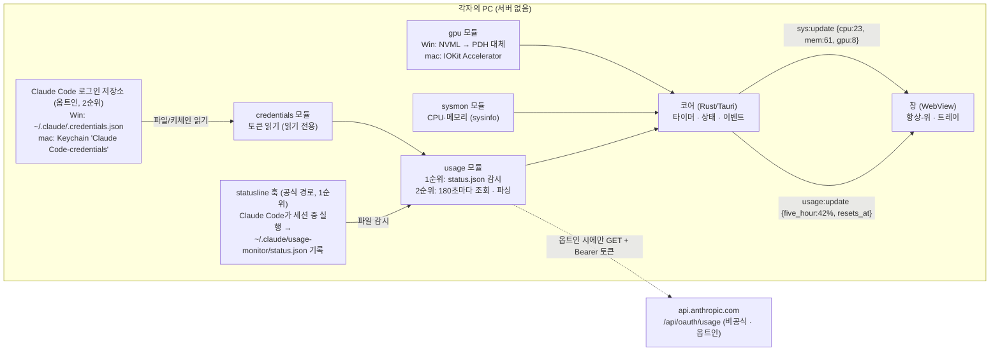

# Claude 사용량 상시 표시 창 — 설계 문서 (v0.1, 2026-09-03)

> 이 문서가 설계의 단일 원천이다. P0 결정과 미결 질문은 [[DECISIONS]], 선행 도구 조사는
> [[PRIOR-ART-SURVEY]], 진행 기록은 [[WORKLOG]]에 있다. 화면 시안(G3)은 사용자와 함께
> 별도 세션에서 만들기로 했으므로 이 문서는 **구조·데이터·배포**만 다룬다.

## 0. 한 문단 요약

각자의 PC(Windows·macOS)에서 **자기 Claude 구독 한도(5시간 창·주간)** 와 **이 PC의 CPU·메모리·GPU
사용률**을 작은 항상-위(always-on-top) 창 하나에 보여 주는 프로그램이다. 서버는 없다. Claude 사용량은
**Claude Code가 이미 로컬에 저장해 둔 로그인 토큰**을 읽기만 해서 Anthropic의 사용량 조회 주소에 물어보고,
시스템 지표는 OS가 제공하는 값을 1~2초마다 읽는다. 동료에게는 설치 파일 하나(Windows `.msi`, macOS `.dmg`)로
나눠 준다.

## 1. 요구사항 (사용자 원문 → 확정 요구)

| # | 사용자 표현 (2026-09-03) | 확정 요구 |
|---|---|---|
| R1 | "클로드의 사용량을 보여주는 창" | 구독 한도 창(5시간·주간) 사용률과 초기화 시각을 표시한다 (§2 전제 A1) |
| R2 | "PC에 상시적으로 띄우고" | 항상-위 소형 창 + 트레이/메뉴바 아이콘. 부팅 시 자동 실행은 선택 사항 |
| R3 | "PC 버전과 맥버전" | Windows 10/11 x64, macOS(Apple Silicon 우선, Intel은 가능하면) — 둘 다 1급 |
| R4 | "주변 사람들과 같이 쓰고" | 개발 도구 없이 설치 가능한 배포물. 각자 자기 계정. 서버·계정 공유 없음 |
| R5 | "GPU와 메모리 사용량도", "CPU도" | CPU %, 메모리 사용/전체, GPU 사용률(+GPU 메모리)을 같은 창에 표시 |
| R6 | "아주 간단한 프로그램" | 설정 화면 최소, 기능 추가 억제. 이 문장이 스코프의 상한이다 |

## 2. 전제 (확인되지 않은 것은 [[DECISIONS]]의 질문으로 넘긴다)

- **A1. "Claude 사용량" = 구독 한도 사용률.** Claude Code의 `/usage`가 보여 주는 것과 같은 값
  (5시간 창 %, 주간 % — 전체 모델과 Opus 별도, 각 초기화 시각). API 키 조직의 비용 보고서(Admin API)는
  범위 밖이다. 로컬 토큰·비용 집계(Claude Code 기록 파싱)는 **2단계 선택 기능**이다.
- **A2. 사용자와 동료 모두 Claude Code에 로그인되어 있다.** 한도 조회에 쓰는 토큰은 Claude Code가
  로그인할 때 로컬에 저장한 것을 **읽기만** 한다. 웹(claude.ai)만 쓰는 사람은 이 앱으로 한도를 볼 수 없다.
  → [[DECISIONS]] Q2.
- **A3. 한도 값을 얻는 공식 경로는 하나뿐이고, 비공식 경로는 약관 문제가 있다** ([[PRIOR-ART-SURVEY]] §1·§2,
  2026-09-03 조사). 공식 경로는 Claude Code의 **statusline JSON**(`rate_limits.five_hour.used_percentage` 등)이며
  Claude Code 세션이 떠 있을 때만 갱신된다. 비공식 경로(`/api/oauth/usage` + Claude Code 토큰)는 값이 항상
  나오지만, Anthropic이 2026-02-19에 "구독 계정의 OAuth 토큰을 다른 도구에서 쓰는 것은 소비자 약관 위반"으로
  명문화했다 (실제 차단은 추론 도구에만 내려졌고 조회 도구는 묵인 중). 따라서 **공식 경로를 1순위**로 하고 비공식
  경로는 **사용자가 고지를 읽고 켜는 옵트인**으로 둔다 (§5.1, [[DECISIONS]] Q4).
- **A4. 사용자 PC 실측 (2026-09-03)**: RTX 4090(별도 VRAM 24GB), `nvidia-smi` 동작, Windows 성능 카운터
  `GPU Engine` 존재, Node 24·Python 3.12 설치됨, Rust 툴체인 없음. MacBook은 Apple Silicon으로 가정.

## 3. 시스템 구조



**모듈 경계 원칙**: 코어(Rust)와 창(WebView) 사이는 **JSON 이벤트 두 종류**만 오간다. 창은 값을 받아
그리기만 하고, 토큰·파일·OS API를 직접 만지지 않는다. 이 경계가 이 프로젝트의 유일한 "모듈 간 인터페이스"이며,
바뀌면 G6(이해 확인 퀴즈) 조건부 게이트 대상이다.

## 4. 데이터 계약 (코어 → 창)

```jsonc
// usage:update — 값이 바뀔 때마다 (훅 파일 갱신 시, 또는 옵트인 조회 후)
{
  "source": "statusline" | "oauth",          // 어느 경로에서 온 값인지 창에 표시한다 (조사 교훈 E.1)
  "status": "ok" | "stale" | "no_source" | "no_token" | "auth_expired" | "rate_limited" | "unreachable" | "shape_changed",
  "fetched_at": "2026-09-03T01:42:10Z",
  "five_hour":  { "used_pct": 42, "resets_at": "2026-09-03T02:54:00Z" },
  "seven_day":  { "used_pct": 18, "resets_at": "2026-09-08T00:00:00Z" },
  "seven_day_opus": { "used_pct": 7, "resets_at": "2026-09-08T00:00:00Z" } // 없으면 null
}

// sys:update — 1~2초마다
{
  "cpu_pct": 23,
  "mem": { "used_gb": 19.6, "total_gb": 32.0 },
  "gpu": { "name": "RTX 4090", "util_pct": 8, "mem_used_gb": 2.1, "mem_total_gb": 24.0 } // 미지원이면 null
}
```

- statusline JSON의 필드(`rate_limits.five_hour.used_percentage`, `resets_at` epoch 초)는 공식 문서에 있다.
  `/api/oauth/usage` 응답(`five_hour.utilization`, `resets_at` ISO-8601, `seven_day_opus`, `seven_day_sonnet`)은
  2차 자료 기준이므로 **옵트인 경로를 구현하기 전에 curl 1회로 실측**한다. 두 경로의 필드 이름이 다르므로
  usage 모듈이 위 계약으로 정규화한다.
- `status`가 `ok`가 아니면 창은 **마지막 정상값을 회색으로** 유지하고 상태 문구만 바꾼다. 값이 사라지지 않는다.

## 5. 데이터 소스별 설계

### 5.1 Claude 구독 한도 — 두 경로를 계층으로 쓴다

기존 도구 중 가장 성숙한 것들(CodexBar 계열)은 소스를 **순서가 정해진 계층**으로 두고 어느 계층의 값인지 화면에
표시한다. 같은 방식을 택한다.

**1순위: statusline 훅 (공식 · 정책 안전)**

| 항목 | 설계 |
|---|---|
| 원리 | Claude Code는 세션 중 `settings.json`의 `statusLine.command`를 주기적으로 실행하며 표준 입력으로 JSON을 준다. 그 안의 `rate_limits`가 `/usage`와 같은 값이다 (공식 문서 code.claude.com/docs/en/statusline). Pro/Max 한정, 첫 응답 이후부터 |
| 설치 | 앱이 최초 실행 시 작은 스크립트를 `~/.claude/usage-monitor/`에 놓고, `settings.json`에 statusline 항목을 추가하도록 **사용자 동의를 받아** 설정한다. 사용자가 이미 statusline을 쓰고 있으면 기존 명령을 감싸서(wrapping) 출력은 그대로 두고 JSON만 파일로 복사한다 |
| 읽기 | 앱은 `status.json` 파일을 감시(file watch)한다. 네트워크 호출 없음 |
| 한계 | Claude Code 세션이 없으면 갱신되지 않는다 → `stale` 상태로 마지막 값 + 경과 시간을 보여 준다. 웹·데스크톱 앱만 쓴 사용량은 다음 Claude Code 세션 때 반영된다 (한도는 계정 단위로 합산되므로 값 자체는 정확하다) |

**2순위: `/api/oauth/usage` 조회 (비공식 · 옵트인)**

| 항목 | 설계 |
|---|---|
| 켜는 방식 | 기본 **꺼짐**. 설정에서 켤 때 "Anthropic 약관상 구독 토큰의 제3자 사용은 금지되어 있으며, 실제로는 조회 용도로 묵인되고 있으나 계정 제재 가능성을 배제할 수 없다"는 고지를 보여 주고 동의를 받는다 |
| 토큰 위치 | Windows `%USERPROFILE%\.claude\.credentials.json`(`claudeAiOauth.accessToken`), macOS 키체인 `Claude Code-credentials`(계정 `$USER`). `CLAUDE_CONFIG_DIR`가 설정돼 있으면 그 경로를 따른다 |
| 읽기 방식 | **읽기 전용.** 토큰 갱신(refresh)은 하지 않는다 — Claude Code의 갱신 토큰 회전과 경쟁해 로그인이 풀릴 수 있고, 갱신 호출은 "제3자 사용"의 가장 명백한 형태다. 만료되면 "Claude Code를 한 번 실행해 주세요"로 안내 |
| 요청 헤더 | `Authorization: Bearer`, `anthropic-beta: oauth-2025-04-20`, **`User-Agent: claude-code/<버전>`** (없으면 429 지속 — 조사 B.1.1) |
| 조회 주기 | **180초** (토큰 단위 제한 때문). 창을 다시 열면 즉시 1회, 단 직전 조회에서 60초 이내면 생략 |
| 실패 처리 | 401 → `auth_expired`, 429 → `rate_limited`(주기를 10분으로), 5xx·네트워크 → `unreachable`, JSON 필드 누락 → `shape_changed` |
| 보안 | 토큰은 메모리에만. 로그·파일·화면에 남기지 않는다. 앱은 Anthropic 외 어디에도 접속하지 않는다 (버전 확인용 GitHub Releases 조회 제외, 이것도 선택) |
| macOS 추가 위험 | 키체인 항목의 접근 제어 강화가 예고돼 있어(조사 §1-4) 어느 날 읽기가 막힐 수 있다. 막히면 `no_token`으로 내려앉고 1순위 경로는 영향이 없다 |

두 경로가 모두 있으면 **더 최근 값**을 쓰되 `source`를 표시한다. 1순위만으로 충분한지는 M4 시범 배포에서 판단한다
(동료들이 Claude Code를 하루 종일 띄워 두는지에 달렸다).

### 5.2 로컬 토큰·비용 집계 (2차, 선택)

`~/.claude/projects/**/*.jsonl`의 `message.usage`(`input_tokens`, `output_tokens`, `cache_read_input_tokens`,
`cache_creation_input_tokens`)를 합산한다 — 이 PC에서 필드 존재를 확인했다 (2026-09-03 실측, 1건). 같은
메시지가 여러 줄에 나오므로 `message.id + requestId`로 중복 제거가 필요하다(ccusage 방식). 이 소스는
**Claude Code 사용분만** 잡고 웹·데스크톱 앱 대화는 잡지 못한다. 1단계에서는 넣지 않는다 (R6).

### 5.3 시스템 지표

| 지표 | Windows | macOS | 비고 |
|---|---|---|---|
| CPU % | `sysinfo` 크레이트 | `sysinfo` | 두 OS 공통, 권한 불필요 |
| 메모리 | `sysinfo` | `sysinfo` | 사용/전체 GB |
| GPU 사용률 | 1순위 NVML(`nvml-wrapper`) — NVIDIA만. 2순위 PDH `\GPU Engine(*)\Utilization Percentage` 합산 — 제조사 무관 | Apple Silicon: IOKit `IOAccelerator` `PerformanceStatistics`의 `Device Utilization %` (sudo 불필요). Intel Mac: 같은 경로, 미검증 | 어느 것도 안 되면 `gpu: null`로 행 자체를 숨긴다 |
| GPU 메모리 | NVML | Apple Silicon은 통합 메모리라 별도 값 없음 → 표시 생략 | |

샘플링 주기 1~2초. 앱 자체의 CPU 점유가 1%를 넘으면 주기를 늘린다 (측정 항목, M0에서 실측).

## 6. 실패 상태와 표시 규칙

| 상태 | 원인 | 창에 보이는 것 | 사용자가 할 일 |
|---|---|---|---|
| `no_source` | statusline 훅 미설치, 옵트인도 꺼짐 | "설정에서 연결 방법을 고르세요" | 훅 설치 동의 또는 옵트인 |
| `stale` | 훅은 있으나 Claude Code 세션이 없어 갱신 안 됨 | 마지막 값(회색) + "38분 전 값" | 없음 (다음 세션에 갱신) |
| `no_token` | (옵트인) Claude Code 로그인 기록 없음 | 한도 영역에 "Claude Code 로그인 필요" | Claude Code 실행 후 `/login` |
| `auth_expired` | 토큰 만료 | 마지막 값(회색) + "로그인 갱신 필요" | Claude Code를 한 번 실행 |
| `rate_limited` | 429 | 마지막 값 + "5분 뒤 재시도" | 없음 |
| `unreachable` | 네트워크·5xx | 마지막 값 + 경과 시간("12분 전 값") | 없음 |
| `shape_changed` | 응답 형식 변경 (비공식 API 리스크) | "조회 불가 — 앱 업데이트 필요" | 새 버전 설치 |
| GPU 미지원 | 드라이버·제조사 | GPU 행 숨김 | 없음 |

시스템 지표는 항상 뜬다. 한도 조회가 실패해도 창은 살아 있어야 한다 — "부분 고장은 부분만 보인다".

## 7. 배포 (동료 공유)

| 단계 | Windows | macOS |
|---|---|---|
| 산출물 | `.msi` 또는 NSIS `.exe` | `.dmg` (universal 또는 arm64) |
| 서명 | **1단계: 서명 없음.** SmartScreen "추가 정보 → 실행" 안내문 동봉. Windows 11의 Smart App Control이 켜진 PC나 회사 정책이 "실행" 버튼을 막은 PC에서는 설치 불가 (조사 §C) | **1단계: ad-hoc 서명만** (`signingIdentity: "-"`) — 없으면 Apple Silicon에서 "손상됨"으로 뜬다. Gatekeeper는 여전히 막으므로 "시스템 설정 → 개인정보 보호 및 보안 → 그래도 열기 + 관리자 암호" 절차를 안내문에 그림으로 넣는다. Sequoia부터 "우클릭 → 열기"는 통하지 않는다 |
| 서명 도입 시점 | 배포 인원이 5명을 넘거나 IT 정책에 걸릴 때. 저장소를 공개 오픈소스로 두면 **SignPath Foundation 무료 서명**이 가능하다(aqua5230/usage 선례). Azure Artifact Signing은 한국 개인 자격이 불확실(조사 §6) | Apple Developer Program 연 $99 + 공증(notarization). Tauri가 CI에서 지원 |
| 빌드 | GitHub Actions matrix (windows-latest, macos-latest) → GitHub Releases | 동일 |
| 업데이트 | 1단계: 앱이 Releases의 최신 태그만 확인해 "새 버전 있음" 표시. 자동 갱신은 2단계 | 동일 |

동료용 안내는 README 한 장이면 된다: 설치 → Claude Code 로그인 확인 → 창 위치 잡기. 그 이상이면 R6 위반이다.

## 8. 구현 계획 (G4.5 — 바뀔 가능성이 높은 결정을 앞에)

| 순서 | 마일스톤 | 검증 기준 | 바뀔 가능성 |
|---|---|---|---|
| M0 | **관통 골격**: 항상-위 창 + 트레이 + CPU/메모리 표시, Windows에서 `.msi`까지 | 설치 파일을 다른 PC에 넣어 실행되면 통과. 앱 CPU 점유 실측 | 프레임워크 선택이 뒤집히면 여기서 드러난다 |
| M1 | **한도 표시 1순위**: statusline 훅 설치(동의 화면 포함) → `status.json` 감시 → 표시, `stale` 처리 | 이 PC에서 Claude Code 세션을 열고 닫으며 값 갱신·`stale` 전환 확인. 기존 statusline이 있는 사용자 설정에서도 깨지지 않음 | 훅이 실제로 `rate_limits`를 주는지 첫 실측에서 판명 |
| M1b | **한도 표시 2순위(옵트인)**: 고지 화면 → 토큰 읽기 → 조회 → 정규화, 실패 상태 전부 | 로그아웃/로그인/네트워크 차단 3장면에서 §6대로 동작. curl 실측으로 §4 계약 확정 | Q4 답에 따라 통째로 빠질 수 있음 |
| M2 | **GPU**: Windows NVML + PDH 대체, macOS IOKit | RTX 4090 PC, Apple Silicon MacBook, GPU 없는 노트북 3대에서 확인 | macOS 경로가 가장 불확실 |
| M3 | **macOS 빌드**·`.dmg`·설치 안내문, GitHub Actions 2-OS 빌드 | MacBook에서 다운로드→설치→실행 | 서명 없는 배포의 마찰이 크면 §7 앞당김 |
| M4 | **동료 시범 배포** 2~3명 | 한 주 사용 후 고장 목록 수집 | 여기서 R6 압력이 온다 — 기능 요청은 [[DECISIONS]]로 |
| M5 | 선택: 로컬 토큰·비용 패널(§5.2), 서명, 자동 업데이트 | — | 전부 사용자 결정 |

M0에서 **화면 시안 확정본**(별도 세션 산출물)을 받아 창을 만든다. 그 전에는 숫자만 있는 임시 화면으로 골격을 뚫는다.

## 9. 프레임워크 선택 근거

조사 결과([[PRIOR-ART-SURVEY]] §4·§5)는 **Tauri v2**를 뒷받침한다: CPU·메모리·GPU를 두 OS 모두에서 자식
프로세스 없이 프로세스 안에서 읽을 수 있는 유일한 후보이고(sysinfo + nvml-wrapper + PDH + IOKit), 같은 조합으로
6~8MB짜리 트레이 모니터(xinggaoya/system-monitor)와 Windows용 Claude 사용량 트레이 앱(Win-CodexBar)이 이미
존재한다. Electron은 Windows에서 지표를 읽을 때마다 PowerShell을 띄우고 유휴 메모리가 150MB를 넘어 상시 표시
앱에 맞지 않는다. 최종 결정은 [[DECISIONS]] Q3. Electron으로 결정되면 §3의 모듈 이름은 그대로 두고 언어만
바뀐다.

**참고 구현 (G4 — 최고의 레퍼런스는 소스 코드)**: 시스템 지표는 `xinggaoya/system-monitor`(Tauri 2.2 + sysinfo +
nvml-wrapper), Windows PDH GPU는 `precord` 크레이트, Apple GPU는 `andersrennermalm/gpuinfo`(C, IOKit), statusline
캡처는 `bartosz-warzocha/claude-statusbar` 확장의 스크립트, 트레이·항상-위 창 구성은 `nesszer/Win-CodexBar`.

## 10. 범위 밖 (명시적으로 안 하는 것)

- 조직·팀 사용량 합산, 서버, 계정 공유, 원격 조회
- API 키 조직의 비용 보고서(Admin API)
- 토큰 갱신·로그인 대행 (Claude Code가 한다)
- Linux 빌드 (DGX Spark는 이 앱의 대상이 아니다 — 필요해지면 별도 결정)
- 알림·경고음·자동 실행 등 부가 기능 (M4 이후 사용자 결정)
